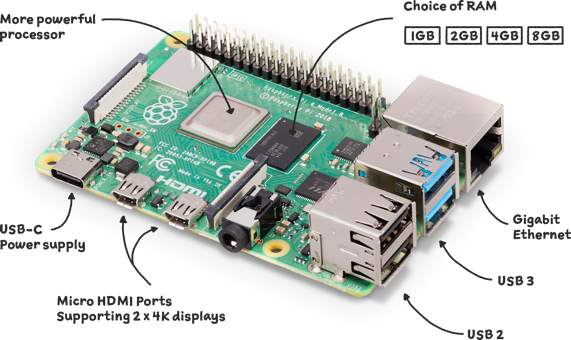
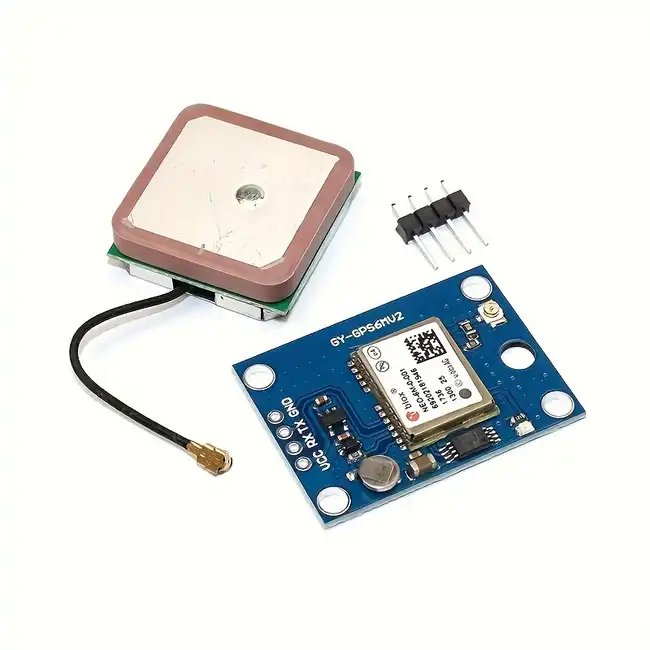
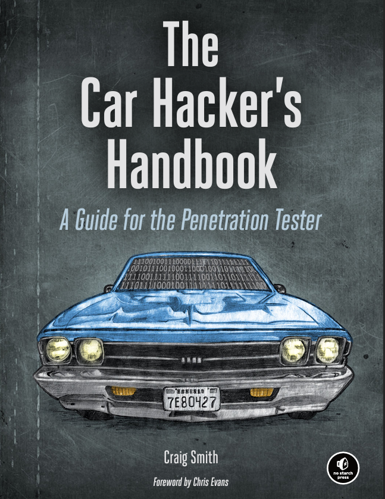
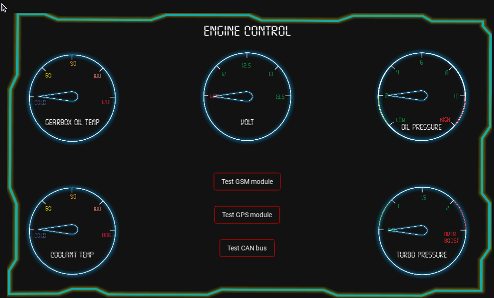
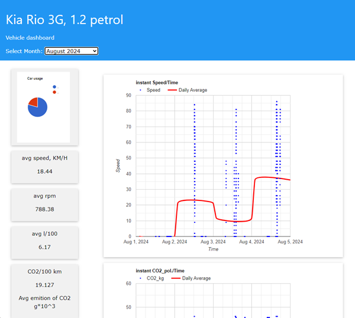
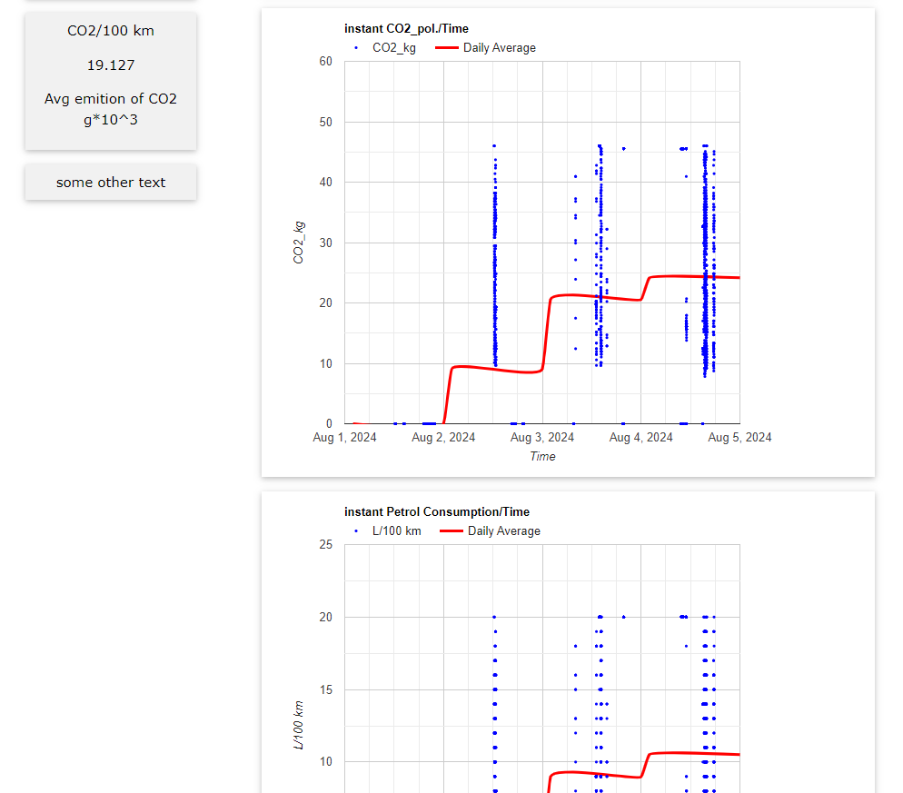
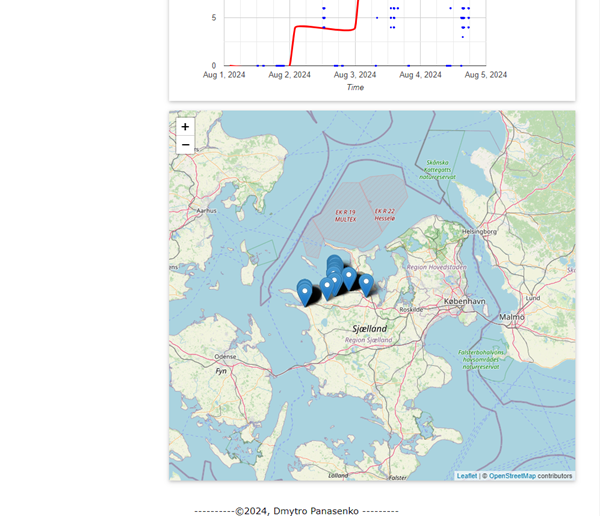

Car Digital Cluster, Web dashboard with relevant information from CAN bus.

The depiction of vehicle CAN information on a gadget's screen in the form of a Digital Cluster is very popular in modern cars.
To innovate in this area, we decided to design and embed a system into the car that can read the CAN bus, 
display the information on its screen, and transmit the data to the web. This system will display the information on a web 
page and store the corresponding data in a database.
This could be particularly useful for tracking your car usage and maintaining its statistical data.

The working platform chosen to bring this idea to life was the Raspberry Pi 4, 
with its corresponding features and capabilities, including support for a high-resolution screen.

link: https://www.raspberrypi.com/products/raspberry-pi-4-model-b/

To communicate with the CAN bus on the vehicle, the CANable adapter was chosen. It is easy to use, affordable 
and compatible with CANViewer and the Python-can library

To send data via GSM I have been using A9GTkinter module:
link: https://docs.ai-thinker.com/gprs 

To read GPS data I have chosen well known and good recommended Neo6m GPS tracker:

To debug our CAN module and verify its functionality, I created a debug module using an Arduino Mega and MCP2515. 
This setup can generate random CAN messages and send them to our CANable module.

As we were able to connect and read data, we could proceed to connect to the car, read the CAN bus using the 
CANable adapter, and use the CANViewer software.

As we know (or for those new to the field), information among vehicle modules is exchanged via CAN bus messages. 
Similar to our computer networks, but instead of PCs as users, there are numerous microcontrollers and modules. 
However, capturing these messages is only the first small step. We need to encrypt and decode them into a format 
understandable to the human eye using reverse engineering techniques, as the information contained in CAN bus messages 
is proprietary
Here is detailed information:
https://www.csselectronics.com/pages/can-bus-simple-intro-tutorial

You have to read a half of relevant internet sources and books. 
I can recommend to start from here: https://www.carhackingvillage.com/getting-started.

And highly recommend this book:

A lot of information about how do automotive network is designed and works.

As I was studying Python and its GUI framework Kivy, I used it to design the main app and deploy it on the Raspberry Pi platform. 
In the end, I developed an app with three screens, which can be navigated by calling popup dialog windows.

1. Clasic view:

2. With a little bit sport features:

3. Service window with relevant sensors' data:

Basically, it works quite well. Before using the CAN bus, I tried to read data via the OBD-II interface with the Python 
OBD library. While it worked, my options were limited to the accessible PIDs, which only provided 7 types of data. 
With the CAN bus, we can access much more. The most challenging part is encrypting the messages and extracting 
the desired information from them.

The retrieved CAN bus data is processed by the app and sent to a web server. PHP scripts manage the data by inserting it 
from the GSM module into a database, extracting it from the database, and building corresponding plots using JavaScript.

http://vehicledata.atwebpages.com/index.html

Finally, we can observe our vehicle's information through the plots, including details such as fuel consumption, 
CO2 emissions, and GPS tracking.

review on youtube:

Trobleshooting which I was encountering with:
Kivy GUI Limitations: Kivy is not the ideal framework for developing digital clusters. Although it works, I initially 
intended to add a map as one of the screen widgets. However, the app struggled with performance, 
leading to significant slowdowns in CAN data processing.

Power Supply for RPI4, A9G, and Neo6m: The Raspberry Pi 4 requires a strict 5V current and draws 0.6A during OS boot. 
This can impact additional components if they share the same power source. The A9G and Neo6m require 0.25A at 5V each. 
Any fluctuation in power supply during Raspberry Pi load can cause signal loss and connectivity issues with networks 
or satellites.

Differences Between Linux and Windows: While Python itself is consistent across platforms, Linux offers a wider variety of libraries. 
For CAN bus functionality, the official python-can library is available, whereas the Peek-System company’s PCANBasic library, 
which we had to compile ourselves, works better for our needs. This last works perfect for me and did not have troubles
as other one which might rise up an error: CAN bus was read to late with refer to cannotifier.py and its timeout

Different Pixel Grid on Laptop and RPi4 Screen: There is a discrepancy between the pixel grids of the laptop and
the Raspberry Pi 4 screen, which affects the visual consistency and layout of the GUI.

Connecting A9G and Neo6m to RPi4 via UART: Successfully connecting the A9G and Neo6m modules to the Raspberry Pi 4 
and ensuring they work together via UART required careful configuration 
