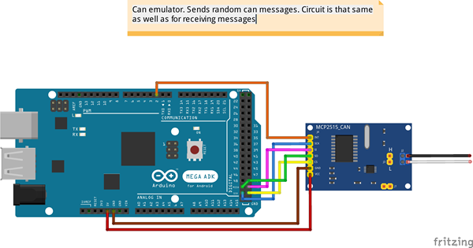

Car Digital Cluster, Web dashboard with relevant information from CAN bus.

The working platform is Raspberry Pi 4

link: https://www.raspberrypi.com/products/raspberry-pi-4-model-b/

communication with the CAN bus on the vehicle via CANable adapter.

To send data via GSM I have been using A9GTkinter module:
link: https://docs.ai-thinker.com/gprs 

To read GPS data I have chosen well known and good recommended Neo6m GPS tracker:

To debug our CAN module and verify its functionality was being used an Arduino Mega and MCP2515.

This setup can generate random CAN messages and send them to our CANable module.

Python and its GUI framework Kivy as developing tool.
In the end was gotten app with 3 screens

1. Clasic view:

2. With a little bit sport features:

3. Service window with relevant sensors' data:

We can call real time plotting touching a gauge and check hardware components taping following buttons

The retrieved CAN bus data is processed by the app and sent to a web server. PHP scripts manage the data by inserting it 
from the GSM module into a database, extracting it from the database, and building corresponding plots using JavaScript.

http://vehicledata.atwebpages.com/index.html

Finally, we can observe our vehicle's information through the plots, including details such as fuel consumption, 
CO2 emissions, and GPS tracking.

review on youtube:

