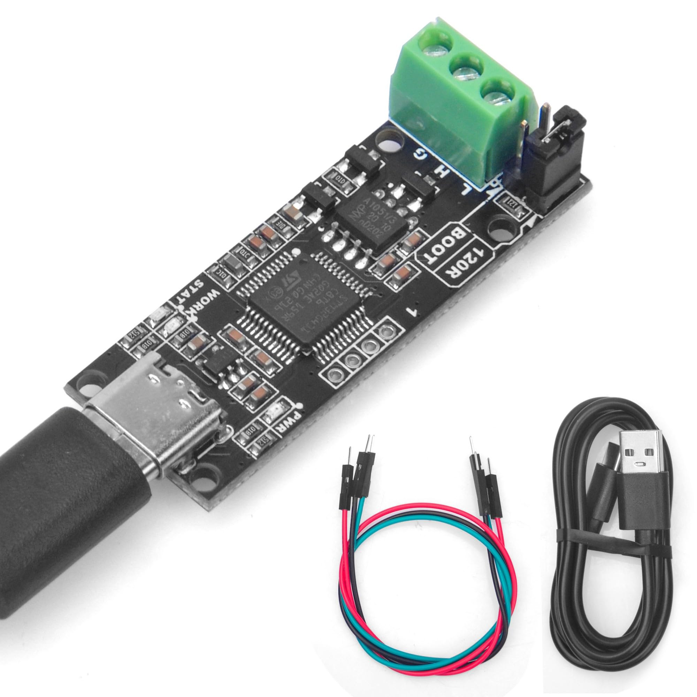
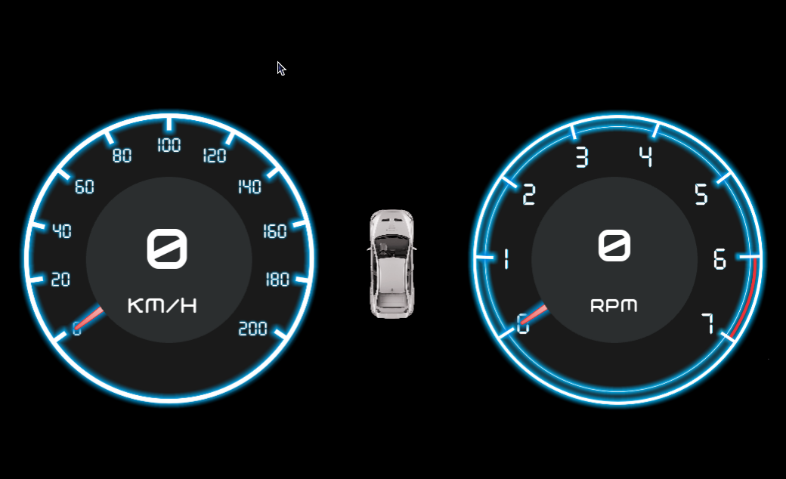
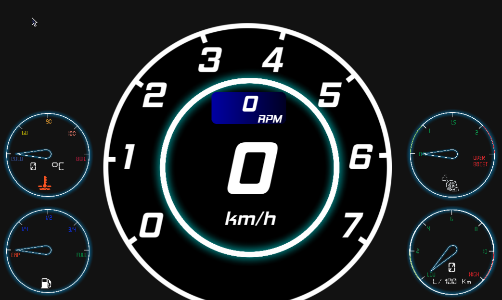
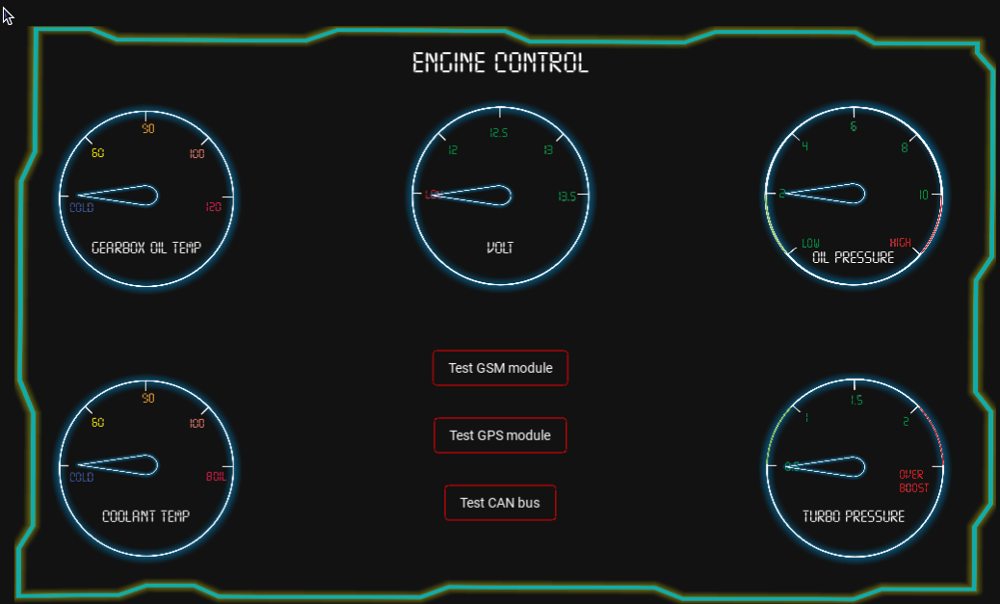

Car Dashboard with relevant information from CAN bus.

Depiction of the vehicle CAN information on the gadget's screen in the form of Digital Cluster as it is so popular nowadays 
on modern cars.

To go further and to bring something new in this area was decided to design and embed into the car system which can 
read CAN bus, depict it on its screen and pass data to the web and depict that information on web page having correspondent 
data in the database.
It might be relevant if you want to keep a track on your car usage and have its statistic data 

The working platform to embed idea into the life was chosen Raspberry pi 4 with correspondent
features and possibilities to have a screen with high resolution.

link: https://www.raspberrypi.com/products/raspberry-pi-4-model-b/

To communicate with CAN bus on the vehicle was chosen CANable adapter. Easy to use, cheap and can interact with CANViewer
and Python-can library

To send data via GSM I have been using A9GTkinter module
link: https://docs.ai-thinker.com/gprs 

To read GPS data I have chosen well known and good recommended Neo6m GPS tracker:

In the case to debug our CAN module and check it's work ability I have made a debug module from Arduino Mega and MCP2515.
It can generate random CAN messages and send it to the our CANable module

As we have could connect and read a data, we could go further and connect to the car, read CAN bus with the CANable and 
CAN-viewer software

As we well know (or maybe some new people not yet) information among vehicle modules is exchanging via CAN bus messages.
Similarly to our network, but instead of PC as users, there are some amount of microcontrollers and modules. But to catch 
messages, its only 1st and small step. We have to encrypt it and decode in understandable for human eye view with reverse 
engineering approach as long as this information, which CAN bus messages belong to modules, is a sicret. 

You have to read a half of relevant internet sources and books. 
I can recommend to start from here: https://www.carhackingvillage.com/getting-started.

And highly recommend this book

A lot of information about how do automotive network is designed and works.

As long as I study Python and its GUI Kivy, I have used it to design main App and deploy it on Raspberry platform. 
In the end I have got the App with 3 screens, which we can shift calling popup dialog window
1. Clasic view:

2. With a little bit sport features:

3. Service window with relevant sensors' data:

